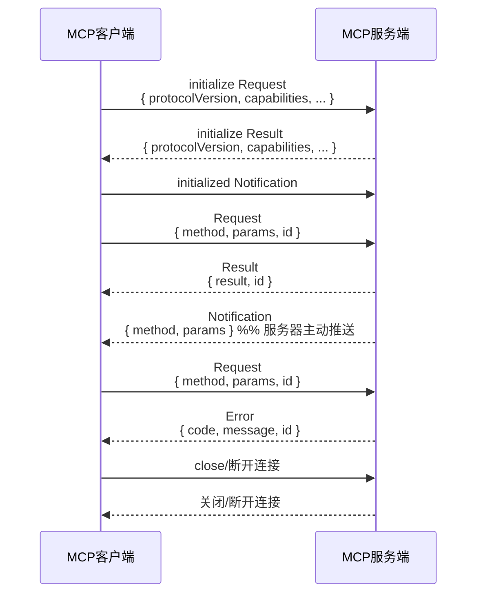

# 大模型MCP协议实现原理与协议格式详解

> 本文整理自官方规范、权威技术博客、开源实现与社区资料，适合AI/大模型开发者深入理解和落地实现MCP协议。引用文献见文末。

---

## 1. MCP协议简介

MCP（Model Context Protocol，模型上下文协议）是由Anthropic等公司推动的开放协议，旨在为大模型（LLM）与外部数据源、工具、上下文管理等提供标准化、可扩展的通信机制。MCP协议极大简化了AI应用与多样化外部系统的集成，提升了模型的上下文感知、工具调用和多智能体协作能力。

MCP协议的设计灵感部分来源于LSP（Language Server Protocol）和现代分布式系统的中间件思想。

---

## 2. 协议分层与核心架构

MCP协议采用典型的**客户端-服务器（Client-Server）架构**，主要分为以下层次：

### 2.1 角色与分层
- **Host（宿主）**：如Claude Desktop、Cursor等AI应用，负责承载AI交互环境，集成MCP客户端。
- **Client（客户端）**：运行于Host内部，负责与MCP Server建立连接，桥接宿主与外部资源。
- **Server（服务器）**：暴露工具、资源、提示等能力，供Client调用。

### 2.2 协议分层结构
1. **传输层（Transport Layer）**
   - 支持Stdio、HTTP+SSE等多种传输方式。
   - 所有传输均基于JSON-RPC 2.0消息格式。
2. **协议层（Protocol Layer）**
   - 负责消息封装、请求-响应关联、通知等高层通信模式。
   - 主要消息类型：Request、Result、Error、Notification。
3. **功能层（Feature Layer）**
   - 服务器端暴露Prompts（提示）、Resources（资源）、Tools（工具）三大能力。
   - 客户端可支持Sampling（采样）、Roots（根目录）等扩展能力。
4. **安全与生命周期管理层**
   - 包括连接初始化、能力协商、权限控制、用户授权、会话管理等。

---

## 3. 协议格式与消息结构

MCP协议所有消息均基于JSON-RPC 2.0，核心消息类型如下：

### 3.1 消息类型
- **Request**：带method和params字段，请求响应式。
- **Result**：请求成功的响应。
- **Error**：请求失败的响应，含错误码和消息。
- **Notification**：单向通知，无需响应。

#### 示例：
```json
{
  "jsonrpc": "2.0",
  "id": 1,
  "method": "listResources",
  "params": {}
}
```

### 3.2 连接生命周期
1. **初始化**：Client发送`initialize`请求，协商协议版本与能力。
2. **能力协商**：双方声明支持的功能（如prompts、tools、resources等）。
3. **正常通信**：支持Request-Response与Notification两种模式。
4. **终止**：任一方可关闭连接。

### 3.3 错误处理
- 标准错误码（如ParseError、InvalidRequest、MethodNotFound等）与自定义错误码。
- 错误通过Error消息返回。

---

## 4. 主要协议能力与扩展

### 4.1 服务器端能力
- **Prompts**：结构化提示模板，支持参数化与复用。
- **Resources**：结构化数据资源（如文件、数据库、API等），唯一URI标识。
- **Tools**：可被模型自动发现和调用的外部工具，含参数校验、结果处理、错误处理等。

### 4.2 客户端能力
- **Sampling**：服务器可请求客户端进行LLM采样（如生成文本、图片等）。
- **Roots**：客户端可暴露文件系统根目录，供服务器访问。

### 4.3 能力协商机制
- 初始化阶段，双方通过capabilities字段声明支持的能力。
- 仅协商成功的能力可在会话中使用。

---

## 5. 安全与信任机制

- **用户授权与控制**：所有数据访问、工具调用需用户显式授权。
- **数据隐私**：Host需获得用户同意后方可暴露数据。
- **工具安全**：工具调用需用户确认，描述信息需谨慎对待。
- **采样控制**：LLM采样需用户批准，服务器无法直接读取全部上下文。
- **OAuth2等认证机制**：支持远程服务器安全接入。

---

## 6. 典型实现与开发建议

- 官方提供Python、TypeScript、Java等多语言SDK。
- 推荐本地进程用Stdio传输，远程用HTTP+SSE，均需TLS加密。
- 消息处理需类型安全、错误友好、超时可控。
- 日志、监控、健康检查、性能分析等为最佳实践。
- 服务器与客户端均可渐进式扩展能力，支持未来协议升级。

---

## 7. 典型应用场景

- 多智能体协作与分布式Agent系统
- RAG（检索增强生成）与知识库集成
- 企业级AI工具链与数据治理
- 代码编辑器/IDE智能助手
- 复杂工作流自动化与多模态AI

---

---

## 8. MCP客户端-服务端数据包交互时序图



---

### 交互流程说明

1. **初始化阶段**
   - 客户端发送 `initialize` 请求，声明协议版本和能力。
   - 服务端返回 `initialize` 结果，确认协议版本和能力。
   - 客户端发送 `initialized` 通知，表示准备好进入正常通信。

2. **正常通信阶段**
   - 客户端可发送各种业务 `Request`（如调用工具、获取资源等）。
   - 服务端返回对应的 `Result`。
   - 服务端可随时通过 `Notification` 主动推送事件（如资源变更、异步任务完成等）。

3. **错误处理**
   - 若请求出错，服务端返回 `Error` 消息，包含错误码和说明。

4. **终止连接**
   - 任一方可主动关闭连接，或因异常断开。

---

### 典型数据包示例

- **Request**
  ```json
  { "jsonrpc": "2.0", "id": 1, "method": "listResources", "params": {} }
  ```
- **Result**
  ```json
  { "jsonrpc": "2.0", "id": 1, "result": { ... } }
  ```
- **Error**
  ```json
  { "jsonrpc": "2.0", "id": 1, "error": { "code": -32601, "message": "Method not found" } }
  ```
- **Notification**
  ```json
  { "jsonrpc": "2.0", "method": "resourceChanged", "params": { ... } }
  ```

---

## 9. 参考文献与权威资料

1. [MCP官方规范](https://spec.modelcontextprotocol.io/specification/2025-03-26)
2. [MCP核心架构](https://modelcontextprotocol.io/docs/concepts/architecture)
3. [Anthropic官方博客-模型上下文协议](https://www.anthropic.com/news/model-context-protocol)
4. [腾讯云-一文读懂MCP](https://cloud.tencent.com/developer/article/2505540)
5. [Medium-MCP技术深度解析](https://medium.com/@singhrajni2210/model-context-protocol-mcp-a-technical-deep-dive-810273a34304)
6. [Medium-MCP综合解读](https://medium.com/@sahin.samia/understanding-the-model-context-protocol-mcp-a-comprehensive-explainer-aa0e1809a046)
7. [MCP官方GitHub文档](https://github.com/modelcontextprotocol/docs)
8. [MCP Python SDK](https://github.com/modelcontextprotocol/python-sdk)
9. [MCP TypeScript SDK](https://github.com/modelcontextprotocol/typescript-sdk)
10. [AI Engineer Summit-MCP Workshop](https://www.youtube.com/watch?v=kQmXtrmQ5Zg)
11. [MCP协议设计原则](https://spec.modelcontextprotocol.io/specification/2024-11-05/architecture/)
12. [MCP协议消息格式详解](https://spec.modelcontextprotocol.io/specification/2024-11-05/basic/)
13. [MCP安全与信任机制](https://spec.modelcontextprotocol.io/specification/2024-11-05/security/)
