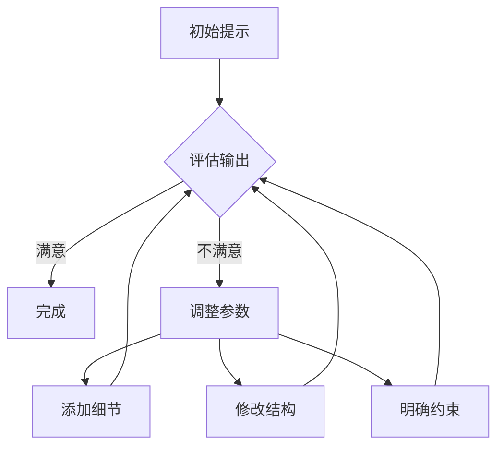

## 目录
- [什么是提示工程？](#什么是提示工程)
- [核心原则](#核心原则)
- [实用技巧](#实用技巧)
- [常见错误](#常见错误)
- [高级策略](#高级策略)
- [工具推荐](#工具推荐)
- [延伸阅读](#延伸阅读)

## 什么是提示工程？
提示工程（Prompt Engineering）是通过精心设计输入指令，引导AI模型输出预期结果的技术。就像程序员需要掌握编程语言，与AI对话也需要特定的"语言艺术"。

**关键要素**：
- 上下文设定（Context framing）
- 指令清晰度（Instruction clarity）
- 输出格式规范（Output formatting）
- 约束条件（Constraints）

## 核心原则
### 1. 明确性至上
```python
# 差示例
"写点关于狗的东西"

# 好示例
"请用300字左右，以科普风格介绍金毛巡回犬的习性特征，要求分点说明，使用中文口语化表达"
```

### 2. 结构化思维
- 角色扮演法：`你是一位资深机器学习工程师...`
- 分步指令：`首先...然后...最后...`
- 模板示例：`请按以下格式输出：\n【标题】\n【要点1】...`

### 3. 动态迭代


## 实用技巧
### 魔法关键词
- `思维链`："请逐步解释..."
- `白板模式`："暂时忘记之前的设定..."
- `苏格拉底式`："通过提问引导我理解..."

### 格式控制
```markdown
请用Markdown格式输出，包含：
# 主标题
## 子标题
- 项目符号
**重点强调**
代码块示例
```

### 参数调节
| 参数        | 适用场景          | 推荐值  |
|-------------|-----------------|--------|
| temperature | 创意生成          | 0.7-1.0 |
| top_p       | 精准控制          | 0.5-0.9 |
| max_tokens  | 响应长度          | 根据需求 |

## 常见错误
1. **模糊指令**  
   ❌ "帮我写个故事"  
   ✅ "创作800字悬疑短篇，主角是退休侦探，故事发生在暴雨夜的伦敦旅馆"

2. **过度约束**  
   ❌ "用七言绝句格式写量子物理科普"

3. **忽略上下文**  
   ```python
   # 错误示范
   User: 翻译这句话："The quick brown fox"
   Assistant: 敏捷的棕色狐狸
   User: 改成拉丁语
   # 缺少上下文关联
   ```

## 高级策略
### 元提示工程
```python
"""
你是一个提示优化专家，请帮我改进以下提示：
原始提示：{user_input}
优化要求：
1. 添加具体场景设定
2. 明确输出格式
3. 包含错误预防机制
"""
```

### 混合模式
```markdown
[系统指令]
你是一位有10年经验的科技专栏作家，擅长用比喻解释复杂概念

[用户请求]
请解释神经网络的反向传播算法

[格式要求]
1. 用烹饪过程做类比
2. 包含3个现实案例
3. 最后用一句话总结
```

### 防御性设计
```python
# 防止幻觉
"请仅基于2023年后的可靠数据源回答，
不确定的内容请明确标注'信息未验证'"

# 防滥用
"如果请求涉及敏感内容，请礼貌拒绝并说明原因"
```

## 工具推荐
1. **PromptPerfect** - 自动提示优化
2. **AI Playground** - 多模型对比测试
3. **PromptBase** - 优质提示市场
4. **LangChain** - 复杂工作流构建

## 延伸阅读
- [OpenAI最佳实践指南](https://platform.openai.com/docs/guides/prompt-engineering)
- 《人工智能交流艺术》- 李明哲 著
- arXiv论文：*Prompt Engineering for Generative AI*

> "优秀的提示工程师不是语法警察，而是AI的心理咨询师。" —— 匿名AI研究员 