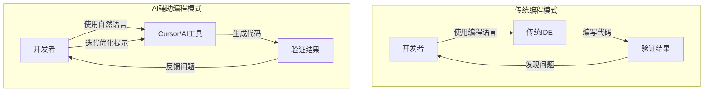

# AI编程变革：从编程语言到自然语言的转变

## 传统编程过程 vs AI辅助编程过程

下面的图表展示了传统编程方式与现代AI辅助编程方式（如Cursor）的对比：

## 编程模式变革的主要区别

| 特征 | 传统编程 | AI辅助编程 |
|------|---------|-----------|
| 输入方式 | 编程语言 | 自然语言 |
| 代码生成 | 手动编写 | AI自动生成 |
| 迭代方式 | 直接修改代码 | 优化提示语言 |
| 学习曲线 | 陡峭（需要掌握编程语言） | 平缓（主要需要表达需求） |
| 开发效率 | 相对较低 | 大幅提升 |
| 适用人群 | 主要是专业开发者 | 更广泛（包括非专业开发者） |

## 结论

AI编程工具如Cursor正在重新定义软件开发流程，使开发者能够更多地专注于解决问题和创新，而不是编写重复性代码。通过自然语言与AI交互，开发过程变得更加高效和包容。 