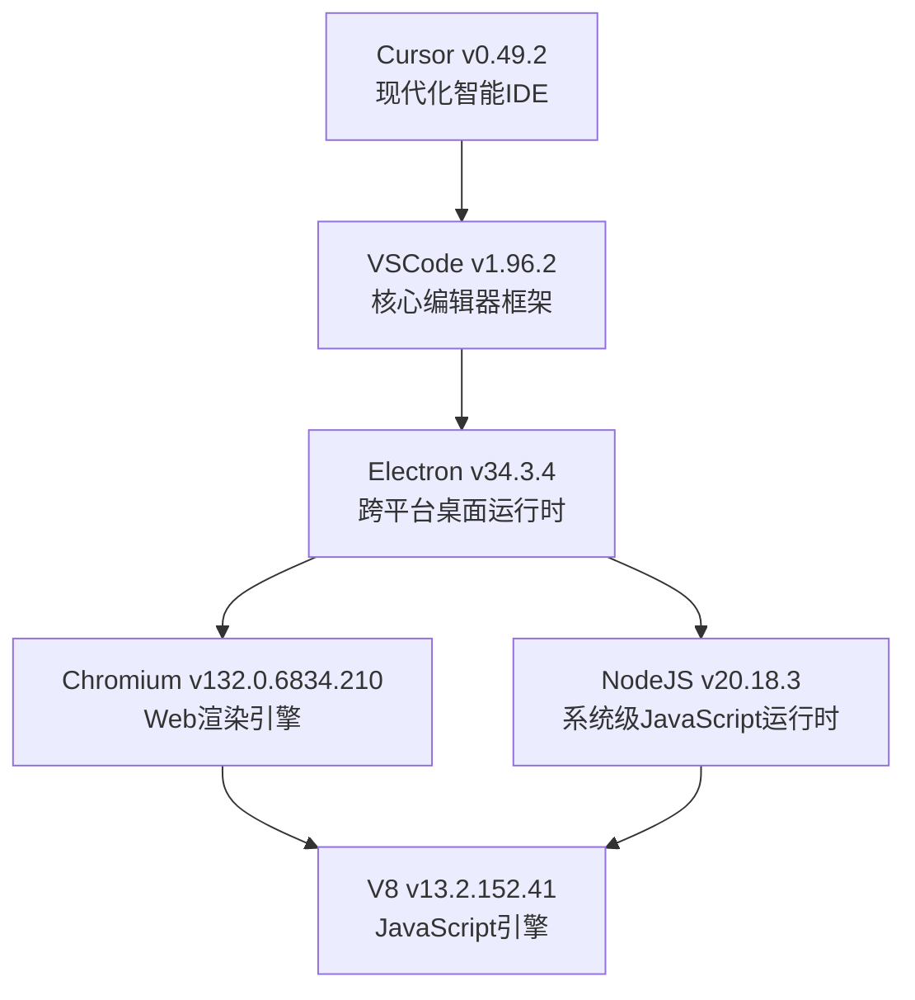

# Cursor 组件关系分析

## 组件关系图

```mermaid
graph TD
    A[Cursor v0.49.2<br>现代化智能IDE]
    B[VSCode v1.96.2<br>核心编辑器框架]
    C[Electron v34.3.4<br>跨平台桌面运行时]
    D[Chromium v132.0.6834.210<br>Web渲染引擎]
    E[NodeJS v20.18.3<br>系统级JavaScript运行时]
    F[V8 v13.2.152.41<br>JavaScript引擎]
    
    A --> B
    B --> C
    C --> D
    C --> E
    D --> F
    E --> F
```
