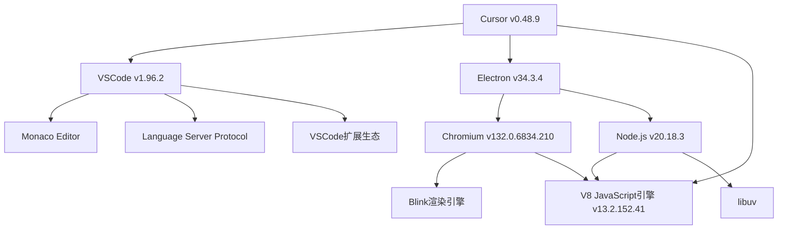

# Cursor编辑器的开源组件分析

Cursor是一款基于VSCode并集成了AI功能的现代代码编辑器。从版本信息中，我们可以看到Cursor基于多个开源组件构建而成。下面我们通过Mermaid图表来展示这些组件之间的关系，并简要介绍每个核心组件。

## 核心组件关系图

## 组件简介

### 核心架构组件

1. **Cursor (v0.48.9)**
   - 构建在VSCode基础上的现代AI编程工具
   - 提供代码智能补全、重构和生成功能
   - 集成了大语言模型(LLM)以提供智能编码辅助

2. **VSCode (v1.96.2)**
   - 微软开发的开源代码编辑器
   - 提供了Cursor的基础界面和编辑功能
   - 拥有丰富的插件生态系统

3. **Electron (v34.3.4)**
   - 使用Web技术构建跨平台桌面应用的框架
   - 结合了Chromium和Node.js
   - 使Cursor能够在多平台上运行

### 核心运行时组件

4. **Chromium (v132.0.6834.210)**
   - 开源Web浏览器项目
   - 提供了界面渲染能力
   - 包含Blink渲染引擎和V8 JavaScript引擎

5. **Node.js (v20.18.3)**
   - 基于Chrome的V8引擎的JavaScript运行时
   - 提供了文件系统访问等后端功能
   - 支持npm生态系统，用于管理包和插件

6. **V8 (v13.2.152.41)**
   - Google开发的高性能JavaScript引擎
   - 为Chromium和Node.js提供JavaScript执行能力
   - 负责编译和执行JavaScript代码

### VSCode核心组件

7. **Monaco编辑器**
   - VSCode的核心编辑器组件
   - 提供语法高亮、代码补全等功能
   - 也可以作为Web组件独立使用

8. **Language Server Protocol (LSP)**
   - 语言服务器协议
   - 为不同编程语言提供统一的智能服务接口
   - 支持代码补全、错误检查、跳转定义等功能

9. **VSCode扩展生态**
   - 丰富的插件系统
   - 提供语言支持、主题、工具集成等功能
   - 使Cursor能够复用VSCode的插件生态

## 结论

Cursor编辑器巧妙地整合了多个开源项目，形成了一个强大的现代代码编辑环境。它以VSCode为基础，结合Electron实现跨平台能力，并通过集成AI技术扩展了传统编辑器的功能边界。这种组件化的架构不仅提供了稳定性和可扩展性，也使得Cursor能够持续受益于开源社区的进步。

从版本信息可以看出，Cursor团队积极跟进各组件的更新，确保用户能够获得最新的功能和安全补丁。 