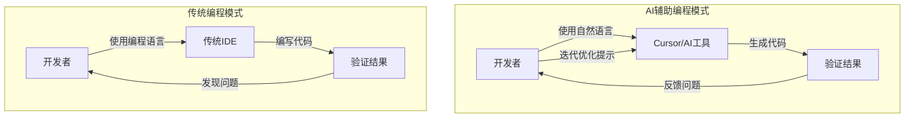
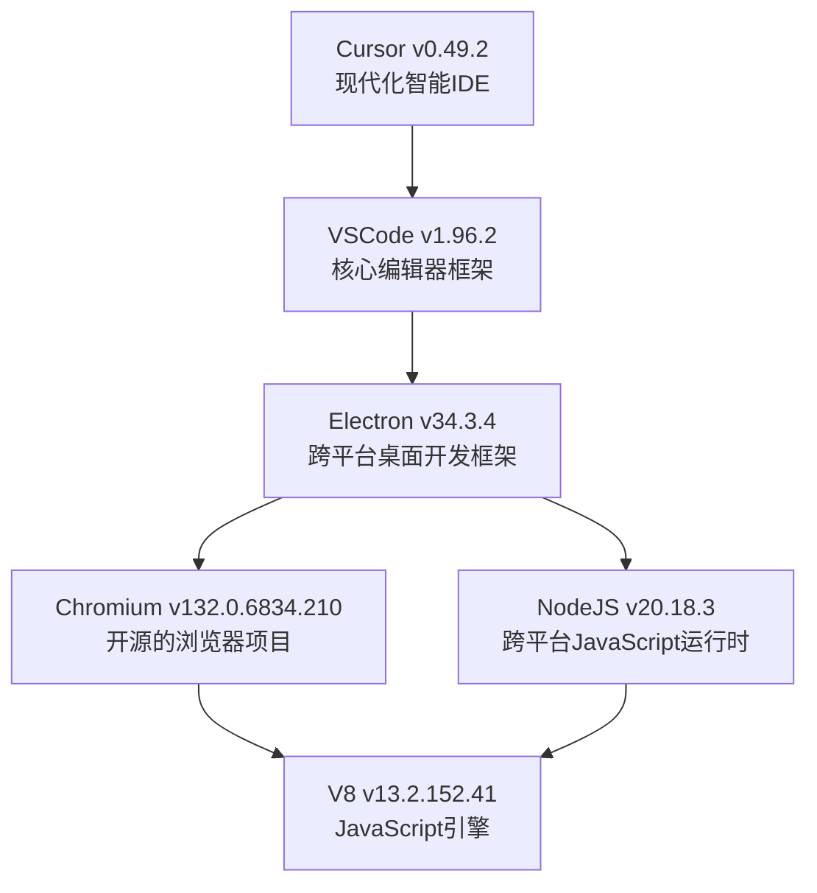

# Cursor使用分享

# 官方定义
Cursor一是款全新的智能IDE，与AI无缝集成。

AI将会彻底改变而非简单替代开发者的工作方式，由此开发的门槛将会变低。以前经常说人人都是产品经理，现在可以说人人都是开发者。

## 开发模式的改变
由高级语言过度到自然语言

## Cursor逐渐模糊开发中的各种界限：
* 语言：大家都是全栈开发人员，不再区分各种语言，是前端还是后端
* 角色：产品、设计、程序员都能编写软件

## Cursor的最终目标
让世界上的任何人都更容易生产软件。当然，还有很长的路要走，据Cursor创始人所言，目前只完成了愿景的2%到3%。

## 关于

让Agent解释一下各组件之间的关系：
> 根据图片生成Cursor所使用到的开源组件之间关系的mermaid图，简要介绍每个组件，以md格式写入到docs目录下。

# 三大对话模式

## Ask
Ask模式是Cursor中的“只读”对话模式，允许你通过AI搜索和查询代码库内容，但不会自动修改任何文件。

只说不做，相对于Agent没有手脚的能力，
拥有检索当前项目、访问Web的能力，无MCP能力。

适合分析、解读、学习项目，思考、探索、头脑风暴等不需要修改的场景。

## Agent
Agent模式是Cursor中最自动化的AI编码模式，能够自主探索、规划并执行复杂的代码库变更，具备全工具访问和多步任务处理能力。
仅此模式支持MCP能力。

### 能力
* 自主操作：独立探索您的代码库，识别相关文件，并做出必要的更改
* 全工具访问：使用所有可用工具进行搜索、编辑、创建文件和运行终端命令
* 上下文理解：构建对您的项目结构和依赖关系的全面理解
* 多步规划：将复杂任务分解成可管理的步骤并按顺序执行

### Cot工作流
* 理解需求
* 检索代码库
* 制定计划
* 执行计划
* 验证结果
* 任务完成

## Manual
Manual模式是Cursor中用于精确、定向代码修改的模式，只根据用户明确指定的文件和指令进行编辑，不会自主探索或运行命令。

手动模式主要使用文件编辑工具。项目搜索和终端工具已禁用。

如果要进行与此项目无关的对话，应该使用这种模式。
此模式速度比较快

# 模型选择

在models模型列表里勾选后才能使用。
* Auto：自动模式，Cursor帮你选择使用最合适的模型。如果不知道怎么选就用这种，体验下来对话速度相对快很多。
* Thinking：使用推理模型，非推理模型将不被使用

# 特性
## Tab
智能补全，多行修改

## 局部编辑
选中要修改的文本块，使用快捷键Ctrl+k打开。

## 新对话（支持多Tab）

* 在合适的时候开启新会话
* 新问题跟当前会话历史消息无关时
* 发现总是得不到你要的答案时，尝试新会话避免记忆干扰
* 减少token消耗，防止token超限
* 多会话并行（按住Alt键+鼠标点击加号或者Ctrl+T）

## 代码库索引
使用RAG技术来准确访问代码库。

Cursor默认会将代码库向量化后存储在向量数据库中，当文件有变化时会增量更新。

通过配置.cursorignore文件来忽略不希望被向量化存储的文件，如：node的node_modules，python的.venv目录等。

## Rules
Rules在设置里作为一个独立的设置项说明他是很重要的。
类似System prompt但是更加灵活，不同对话使用不同的rule。
当应用rule时会将其包含在模型上下文的开始处。这可以增强模型的提示，使其模型给出更加准确的回答。

### 写好Rules
关于项目的信息，开发环境、技术框架、项目结构等。
一些好用的Rules: [Awesome-cursorrules](https://github.com/PatrickJS/awesome-cursorrules)

### 自动生成Rules
Agent根据当前项目情况自动生成合适的rules。

在项目目录下的.cursor/rules目录下自动生成以mdc为后缀的rule文件。

### Rule Type
四种类型，应用rules更加灵活
* Always：总是应用到模型上下文中
* Auto Attached: 设置文件名、后缀匹配规则
* Agent Requested：给规则设置描述，Agent根据此描述来判断使用使用
* Manual：对话时手动@此规则

# 强大的@能力
Cursor内置的工程能力，虽然有时候你不使用@功能Agent也能帮我们进行规划，但是使用@有很多好处：
* 使大模型规划更加聚焦，减少不必要的反思步骤，避免乱改你的代码库。
* Agent快速定位关键位置，否则大模型会全局查找，而且而且很可能找错（如：名称相同的）
* 明确告诉大模型你需要什么能力（如：shell，git，web等）

非常常用的功能，告诉Cursor你想让模型关注的资源：
新开会话时会默认将当前打开的文件@进去。

* 文件，目录，代码
* 文档：一些官方文档或者通过url新增自定义文档
* Rules：明确指定使用需要使用的rules
* 历史对话：引用历史对话
* 最近的改动
* Linter Errors：捕获代码中的错误和警告，保证代码质量，发现潜在的代码问题
* 使用内置工具：web、git、终端

# MCP
模型上下文协议（Model Context Protocol / MCP） 是一个开放的协议，它描述了应用程序如何向 LLMs 提供上下文和工具。可以将 MCP 看作 Cursor 的插件系统-它允许您通过标准化接口将 Agent 连接到各种数据源和工具，从而扩展 Agent 的功能。

## MCP资源
* [https://smithery.ai/](https://smithery.ai/) 使用简单，对小白用户友好，提供了统一的安装方法，一条命令就安装好了，有调试能力。

* [https://mcp.so/](https://mcp.so/) 资源较丰富，有热度排行榜，有调试能力。

* [https://github.com/punkpeye/awesome-mcp-servers](https://github.com/punkpeye/awesome-mcp-servers) 已有40.4k Star

* [https://modelcontextprotocol.io/examples](https://modelcontextprotocol.io/examples) 官方推荐

* [https://cline.bot/mcp-marketplace](https://cline.bot/mcp-marketplace) cline MCP市场

## 推荐好用MCP服务
* server-sequential-thinking
  
Smithery上最火的mcp server，@smithery-ai/server-sequential-thinking（563k）结构化思维，提供动态规划和反思的能力。

但是，在Cursor这样强大的Client上反而作用不大，因为它的Agent已经有这样的能力了，而且集成得更好。

对于自开发的Client或者能力没那么强的Client可以接入尝试下。

* playwright：自动化操作浏览器（获取html后context容易超限）

* 高德地图：近期很火的MCP服务，路线规划，查天气

* 21st.dev：前端UI，界面美化（免费版次数有限）
它会打开一个本地链接让你选样式风格。

* desktop-commander

## MCP服务调试
连接到MCP服务，查看工具列表，手动传入参数调用工具
* 开源项目：https://github.com/modelcontextprotocol/inspector
* 开启服务：npx @modelcontextprotocol/inspector --config C:/Users/jave.tu/.cursor/mcp.json --server mythink
* 浏览器上打开：http://127.0.0.1:6274

## 限制

MCP 是一个创新但仍在快速发展的协议。使用时需注意以下几点限制：

1. 工具数量限制：
   - 问题：某些 MCP 服务器或用户可能有大量可用工具。
   - 当前限制：Cursor 目前只能向 agent 发送前 40 个工具。

2. 远程开发兼容性：
   - 通信方式：Cursor 直接从本地机器与 MCP 服务器通信（通过 stdio 或 sse）。
   - 潜在问题：在 SSH 或其他远程开发环境中，MCP 服务器可能无法正常工作。

3. MCP 资源支持：
   - MCP 服务器功能：提供工具和资源两种主要功能。
   - 当前支持：Cursor 目前只支持工具功能，可执行 MCP 服务器提供的工具并使用输出。
   - 资源支持：目前尚未实现，但计划在未来版本中添加。

4. 服务易断开：
   - 尝试重新开关或者刷新一下
   - 显示红点或者绿点但是没有显示工具列表
   
   

这些限制会在后续持续优化。

